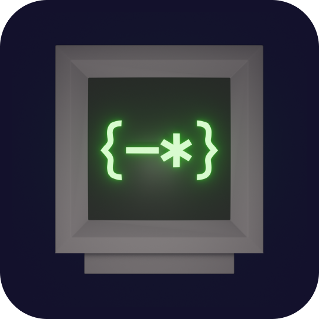

<div align="center">
    
    <h1>Magi</h1>
    <p>A terminal-based Git client.</p>
</div>

---

<div align="center">
    
    
    <a href="https://ratatui.rs"></a>
    
</div>

## Features and goals

Magi is inspired by [Magit](https://magit.vc/), the legendary Emacs Git interface. The goal of this project is to create an as faithful Magit experience as possible for the terminal, removing the need for Emacs.

- **Keyboard-Centric Interface**
- **Faithful emulation of Magit**
- **Vi(m) bindings first class citizen**
- **No Emacs Required**
- **Open PR with a press of a button**


## Installation

```
# Homebrew
brew tap anddani/homebrew-magi
brew install magi

# Nix flake
inputs = {
    magi.url = "github:anddani/magi";
}

...

packages = [
    magi.packages.${SYSTEM}.default;
]

# Arch Linux (AUR)
yay -S magi
    
```

## Theming

Magi is configured through a TOML file at `~/.config/magi/config.toml` (or `$XDG_CONFIG_HOME/magi/config.toml` if set).

### Choosing a theme

```toml
theme = "catppuccin-mocha"
```

Built-in themes:

| Name | Style |
|---|---|
| `default` | Dark |
| `default-light` | Light |
| `catppuccin-frappe` | Dark |
| `catppuccin-mocha` | Dark |
| `catppuccin-latte` | Light |

### Automatic light/dark switching

The default is `theme = "auto"`, which queries the terminal background at startup and picks a dark or light theme accordingly. You can choose which theme is used for each mode:

```toml
theme = "auto"
theme_dark = "catppuccin-mocha"
theme_light = "catppuccin-latte"
```

If `theme_dark`/`theme_light` are not set, `auto` falls back to `default` and `default-light`. If the terminal background cannot be detected (for example when the terminal does not support the OSC 11 query), the dark theme is used.

### Overriding individual colors

Any color can be overridden on top of the selected theme (including auto-resolved themes) in the `[colors]` section:

```toml
theme = "catppuccin-mocha"

[colors]
section_header = "#e5c890"
diff_addition = "green"
selection_bg = "rgb(60, 60, 80)"
dim_text = "244"
```

Colors accept the following formats:

- Named colors: `black`, `red`, `green`, `yellow`, `blue`, `magenta`, `cyan`, `gray`, `darkgray`, `lightred`, `lightgreen`, `lightyellow`, `lightblue`, `lightmagenta`, `lightcyan`, `white`, `reset` (terminal default)
- Hex: `#ff0000` or `#f00`
- RGB: `rgb(255, 0, 0)`
- ANSI 256 index: `0`–`255`

Available color keys:

| Key | Used for |
|---|---|
| `section_header` | Section headings (Unstaged changes, Recent commits, ...) |
| `ref_label` | Branch labels in the log |
| `tag_label` | Tag labels |
| `diff_addition` | Added lines in diffs |
| `diff_deletion` | Removed lines in diffs |
| `diff_context` | Unchanged lines in diffs |
| `diff_hunk` | Hunk headers (`@@ ... @@`) |
| `remote_branch` | Remote branch names |
| `local_branch` | Local branch names |
| `detached_head` | Detached HEAD indicator |
| `untracked_file` | Untracked file paths |
| `unstaged_status` | Unstaged file status |
| `staged_status` | Staged file status |
| `file_path` | File paths in diffs |
| `commit_hash` | Commit hashes |
| `text` | Regular text |
| `dim_text` | Faded text (hints, log author/time) |
| `selection_bg` | Background of the highlighted line |
| `status_bar_bg` / `status_bar_fg` | Status bar |
| `status_mode_normal_bg` / `status_mode_normal_fg` | NORMAL mode indicator |
| `status_mode_visual_bg` / `status_mode_visual_fg` | VISUAL mode indicator |
| `status_mode_search_bg` / `status_mode_search_fg` | SEARCH mode indicator |
| `search_match_bg` / `search_match_fg` | Search match highlight |

## Text editing keys

All text inputs (branch names, search, filters, credentials) support readline-style editing:

| Keys | Action |
|---|---|
| `Left`/`Right`, `Ctrl+b`/`Ctrl+f` | Move by character |
| `Alt+Left`/`Alt+Right`, `Alt+b`/`Alt+f` | Move by word |
| `Home`/`End`, `Ctrl+a`/`Ctrl+e` | Start/end of line |
| `Backspace`, `Ctrl+h` | Delete character backward |
| `Delete`, `Ctrl+d` | Delete character forward |
| `Alt+Backspace`, `Ctrl+w`, `Ctrl+Backspace` | Delete word backward |
| `Alt+d` | Delete word forward |
| `Cmd+Backspace`, `Ctrl+u` | Delete to start of line |
| `Ctrl+k` | Delete to end of line |

Notes for macOS users:

- `Cmd+Backspace` requires a terminal that supports the kitty keyboard protocol (kitty, Ghostty, WezTerm, recent iTerm2). `Ctrl+u` works everywhere.
- The `Alt` (Option) bindings require "Use Option as Meta key" to be enabled in Terminal.app/iTerm2.

## Motivation

There are many Git TUIs out there. Here are a couple:

- [Gitu](https://github.com/altsem/gitu)
- [Lazygit](https://github.com/jesseduffield/lazygit)
- [Gitui](https://github.com/gitui-org/gitui)

They are all great but what they lack is the "editor like" experience you get with [Magit](https://magit.vc/).
This project aims to allow [Magit](https://magit.vc/) users to use this application with low friction.
Here are a few features that the aforementioned applications lack:

- **Search through buffer**: By pressing '/', you can search through the information in the visible buffer
- **Visual select**: Entering visual select using 'V' will allow you to stage a range of lines in a hunk, select a few files to stage, or a few stashes to drop
- **Faithful keybindings**: Magi will preserve the default keybindings in Magit+Evil (and potentially Emacs bindings) in order to make onboarding easier
- **Legible commit graph**: Easy navigation and overview of the commit graph
- **Contextual commands**: All commands are available at any time, using the highlighted or selected line(s) as context to automatically figure out intent

## Roadmap

- [x] Repository status view (HEAD, push ref, tags)
- [x] Untracked files display
- [x] Staged/unstaged changes with inline diffs
- [x] Stage and unstage files
- [x] Expand/Collapse sections
- [x] Keyboard navigation
    - [x] Move up/down
    - [x] Scroll viewport
    - [x] Visual select
- [x] User dismissable popup
- [x] Toast
- [x] Configurable color themes
- [ ] Commands
    - [x] Apply
    - [x] Branch
    - [ ] Bisect
    - [x] Commit
    - [ ] Clone
    - [x] Fetch
    - [x] Pull
    - [x] Help
    - [ ] Log
        - [x] Local
        - [x] Other
        - [ ] Related
        - [x] Local branches
        - [x] All branches
        - [x] All references
        - [ ] Current reflog
        - [ ] Other reflog
        - [ ] HEAD reflog
        - [ ] Shortlog
    - [ ] Merge
    - [ ] Remote
    - [ ] Submodule
    - [ ] Subtree
    - [x] Push
    - [ ] Rebase
    - [x] Tag
    - [ ] Note
    - [x] Revert
    - [ ] Apply patches
    - [ ] Format patches
    - [x] Reset
    - [ ] Show refs
    - [x] Stash
    - [ ] Worktree
- [ ] Applying changes
    - [ ] Apply
    - [x] Reverse
    - [x] Discard
    - [x] Stage
    - [x] Unstage
    - [x] Stage all
    - [x] Unstage all


## License

[MIT](./LICENSE)
